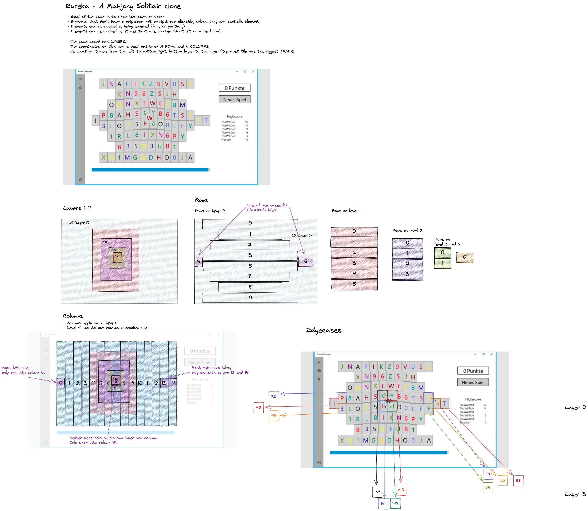

# Eureka fun project

Eureka is one of many names for the game [**Mahjong Solitaire**](https://en.wikipedia.org/wiki/Mahjong_solitaire).

# Installation

- Use yarn to install packages
- [install the pscale client](https://github.com/planetscale/cli#installation)
- create your own database (free) to run locally and add DATABASE_URL to .env

# Usage

You start the game with `yarn start` and open `localhost:3000`.

# Documentation

